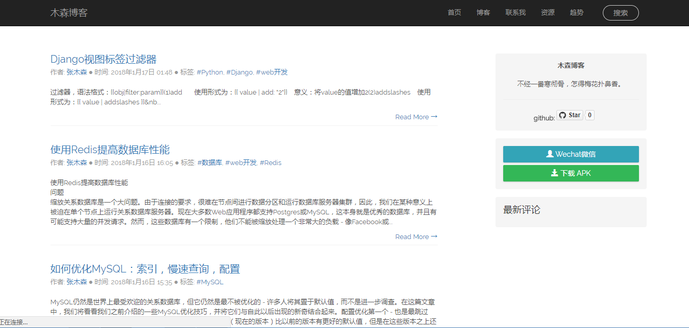
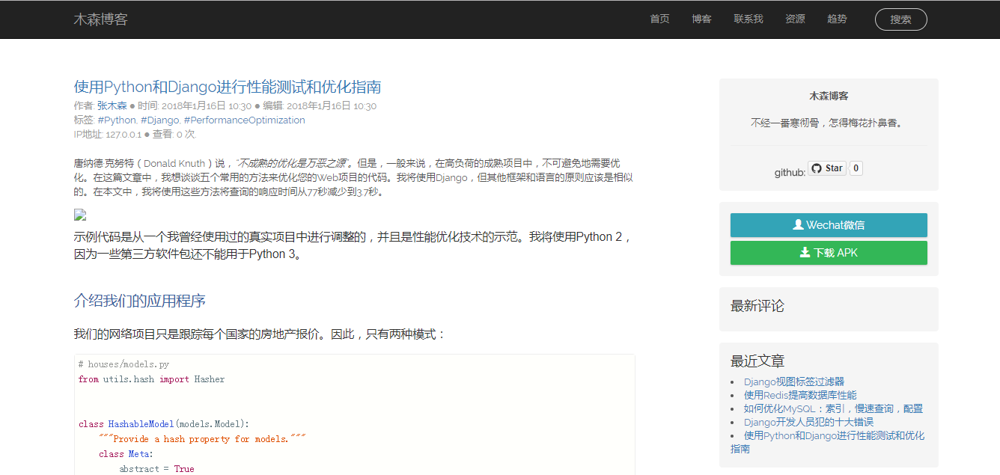
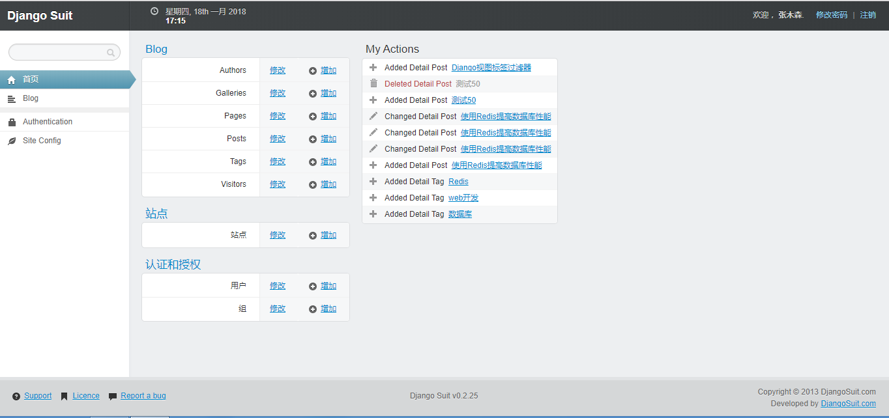

## 博客 CentOS  + Django + MySQL + uwsig + Nginx
-------

### 演示:
- [http://106.14.171.154/blog](http://106.14.171.154/blog) 已失效
- [http://www.billionhouse.com/blog](http://www.billionhouse.cn/blog) 已失效


- Django 2.0.1
- Python 3.6
- MySQL

### 环境依赖

- diff-match-patch==20121119
- Django==2.0.1
- django-disqus==0.5
- django-import-export==0.7.0
- django-nocaptcha-recaptcha==0.0.20
- django-suit==0.2.25
- django-wysiwyg-redactor==0.5.1
- et-xmlfile==1.0.1
- freeze==1.0.10
- jdcal==1.3
- mock==2.0.0
- odfpy==1.3.6
- openpyxl==2.4.9
- pbr==1.10.0
- Pillow==5.0.0
- PyMySQL==0.8.0
- pytz==2016.6.1
- PyYAML==3.12
- six==1.10.0
- tablib==0.12.1
- unicodecsv==0.14.1
- xlrd==1.1.0
- xlwt==1.3.0
- uWSGI==2.0.15
### 安装

**1. 创建虚拟环境.**

```
$ python -m even yourenv
$ source bin/activate
```

**2. 克隆项目**

```
$ git clone https://github.com/Aibd/blogproject.git
```

**3. 安装所有依赖包**

```
$ pip install -r requirements.txt
```

**4. 数据库 迁移**

```
$ ./manage.py makemigrations
$ ./manage.py migrate
```

**5. 运行服务**

```
$ ./manage.py runserver
```
-------
**6. 生产环境配置**
```
 # blog_uwsgi.ini file
    [uwsgi]

    socket = 127.0.0.1:8000
    # Django-related settings
    # the django project directory (full path)
    chdir           = /var/site/blogproject
    # Django's wsgi file
    module          = blogproject.wsgi

    # process-related settings
    # master
    master          = true
    # maximum number of worker processes
    processes       = 2

    threads = 2
    max-requests = 6000

    # ... with appropriate permissions - may be needed
    chmod-socket    = 664
    # clear environment on exit
    vacuum          = true
    # daemon process
    daemonize = /var/site/blogproject/uwsgi.log
```
uwsgi --ini blog_uwsgi.ini
```
server {
        listen       80 default_server;
        listen       [::]:80 default_server;
        server_name  www.billionhouse.cn;
	server_name  106.14.171.154;
        #root         /usr/share/nginx/html;

        # Load configuration files for the default server block.
        include /etc/nginx/default.d/*.conf;

        location / {
		 #proxy_pass http://127.0.0.1:8000;
		 uwsgi_pass 127.0.0.1:8000;
                 include	/etc/nginx/uwsgi_params;
     		 proxy_set_header Host $host;
     		 proxy_set_header X-Real-IP $remote_addr;
     		 proxy_set_header X-Forwarded-For $proxy_add_x_forwarded_for;
     		 proxy_set_header X-Forwarded-Proto $scheme;
        }
	location /static {
		alias /var/site/blogproject/staticfiles;
	}

	location /media {
		alias /var/site/blogproject/media;
	}

       #error_page 404 /404.html;
            location = /40x.html {
        }

       #error_page 500 502 503 504 /50x.html;
            location = /50x.html {
        }
    }

```
   sudo nginx -t
   sudo systemctl restart nginx
### 截图:

#### 主页



#### 详细博文



#### 后台管理 _(用 django suit)_


